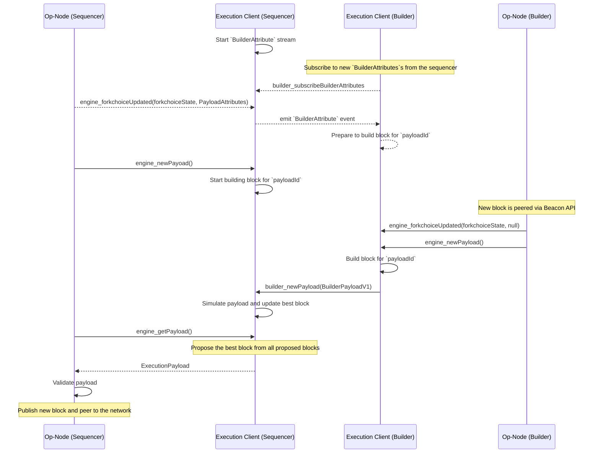

# Builder API
<!-- START doctoc generated TOC please keep comment here to allow auto update -->
<!-- DON'T EDIT THIS SECTION, INSTEAD RE-RUN doctoc TO UPDATE -->
**Table of Contents**

- [Overview](#overview)
- [Sequencer Builder Interaction](#sequencer-builder-interaction)
  - [Liveness Failsafe](#liveness-failsafe)
  - [Mempool Forwarding](#mempool-forwarding)
  - [Builder Configuration](#builder-configuration)
- [Structures](#structures)
  - [`BuilderAttributesV1`](#payloadrequestv1)
  - [`BuilderPayloadV1`](#builderpayloadv1)
<!-- - [Methods](#methods)
  - [`builder_getPayloadV1`](#builder_getpayloadv1)
  - [`builder_forwardTransactionV1`](#builder_forwardtransactionv1) -->

<!-- END doctoc generated TOC please keep comment here to allow auto update -->

## Overview

This document provides an in-depth specification for integrating a Builder API within the Optimism Protocol
and Stack. The Builder API provides a standardized interface for block construction and transaction management
between the Sequencer and a local Block Builder. The specified interactions are the minimum viable design
needed to allow a local Block Builder.

By decoupling the block construction process from the Sequencer's Execution Engine, operators can tailor transaction
sequencing rules without diverging from the standard Optimism Protocol Client. This flexibility allows individual chains
to experiment on sequencing features, providing a means for differentiation. This minimum viable design also includes
a local block production fallback as a training wheel to ensure liveness and network performance in the event of
local Block Builder failure.

It is important to note that this document ***does not*** outline how to safely enable a permissionless
Block Builder Network to serve payloads or how to manage Block Builder configs on L1.

## Sequencer Builder Interaction

- **BuilderAttribute Stream**: Upon initialization, the Sequencer EL starts a `BuilderAttribute` stream, enabling external block builders to consume the update and prepare to construct a new block for a given `payloadId`.

- **Fork Choice Update**: The Sequencer CL sends a Fork Choice Update to its EL (including `PayloadAttributes`), indicating an update to the chain's latest head. The EL then publishes a `BuilderAttributesV1` event to the stream.

- **Send Builder Payload**: After the builder consumes the latest `BuilderAttributesV1` from the sequencer, it will start to prepare a new block inserting the txs from the `transactions` field included in the `PayloadAttributes`. Once the builder EL receives an `ExecutionPayloadV2` from its CL where the `blockHash` matches the `headBlockHash` from the FCU, it will finish constructing a new block and send a `BuilderPayloadV1` message to the sequencer EL via the `builder_newPayload` endpoint. The Sequencer ***MUST*** simulate the received payload to ensure correctness until an accountability mechanism can be introduced.

- **Propose New Block**: The Sequencer EL will continuously receive/validate new blocks via the `builder_newPayload` endpoint until the CL sends a `engine_newPayload` request. At this point, the EL will return the best block that was received for a given `payloadId`.

### Liveness Failsafe

To maintain network liveness while utilizing the Builder API, the Sequencer ***MUST*** operate an auxiliary process when building blocks. This process concurrently evaluates newly built blocks recieved via the `builder_newPayload` enpoint alongside a local block production request through its local execution engine. This two-pronged strategy for generating blocks ensures that network liveness persists, even in instances where the Block Builder's block construction process experiences delays or is offline. This fallback mechanism should be seen as a training wheel.

### Mempool Forwarding

A builder network's throughput is conditional on the transactions it sees. Thus the Sequencer's Execution Engine, or simply it's RPC, can forward transactions to the Builder as part of regular mempool management, ensuring that user transactions are included in the Block Builder's block construction process efficiently.

### Builder Configuration

A builder is defined as the tuple (`builderPubkey`, `builderUrl`). The Sequencer is responsible for managing this tuple, but it will eventually live on the L1 [`SystemConfig`](https://github.com/ethereum-optimism/specs/blob/main/specs/protocol/system_config.md)
where changes are emitted as an event. ***Builder's have no restriction or policies enforced on them at this time.***

## Structures

### `BuilderAttributesV1`
This structure contains information necessary start constructing a new block for a given `payloadId`.

- `forkChoiceUpdate`: `ForkChoiceStateV1`
- `payloadAttributes`: `PayloadAttributesV2`
- `payloadId`: `DATA`, 8 Bytes - Identifier of the payload build process

### `BuilderPayloadV1`

This structure represents the Block Builder's response to the request for payload.

- `executionPayload`: `ExecutionPayloadV2`
  - ([spec](https://github.com/ethereum/execution-apis/blob/main/src/engine/shanghai.md#executionpayloadv2))
- `pubKey`: `Address`
- `value`: `uint256` 

<!-- 
## Methods

### `builder_getPayloadV1`

**Request**

- **method**: `builder_getPayloadV1`
- **params**:
    1. `payload`: `PayloadRequestV1`
        - **Required**: true
        - **Description**: Details of block construction request for local Block Builder
  - `signature` : `Signature`
    - **Required**: true
    - **Description**: `secp256k1` signature over `payload`
- **timeout**: 200ms
- **retries**: 0
  - Timeout does not leave enough time to retry for this block, Sequencer ***SHOULD*** use local block and move on.

**Response**

- **result**: `BuilderPayloadV1`
- **error**: code and message set in case an exception happens while getting the payload.

**Specification**

1. Client software ***MAY*** call this method if `builderPubkey` and `builderUrl` are set.
2. Client software ***MUST*** validate that the response object `BuilderPayloadV1` contains `executionPayload`
and that `pubKey` matches the registered `builderPubkey`.
3. Client software ***MUST*** follow the same specification
as [`engine_newPayloadV3`](https://github.com/ethereum/execution-apis/blob/main/src/engine/cancun.md#executionpayloadv3)
with the response body `executionPayload`.
4. Client software ***MUST*** simulate transactions in `executionPayload` on `parentHash` in`payload` all fields
in `executionPayload` are correct as compared to local view of chain.
5. Client ***SHOULD*** use local block in the event of a timeout from calling `builder_getPayloadV1`.

### `builder_forwardTransactionV1`

**Request**

- **method**: `builder_forwardTransactionV1`
- **params**:
    1. `transaction`: `string`
        - **Required**: true
        - **Description**: Hex Encoded RLP string of the transaction
- **timeout**: 200ms
  - Short timeout to increase chance of including high priority gas transactions in the Builder's current block
- **retries**: 5
  - Needed to ensure user transactions do not get "lost" in event of a failed post. Client ***SHOULD*** log
    loudly in event all 5 retries fail.

**Response**

- **result**: `status`
- **error**: code and message set in case an exception happens while storing the transaction.

**Specification**

1. Client software ***MAY*** call this method if `builderPubkey` and `builderUrl` are set.
2. Client software ***MUST*** retry if status is not `200`. 
 -->
